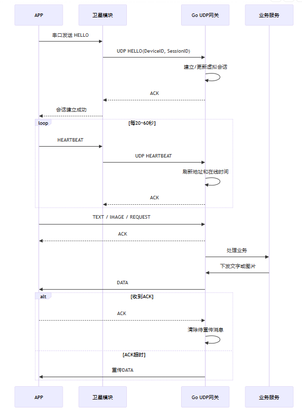

# satellite
satellite communication in udp protocol

## roadmap
| 阶段 | 实现内容 | 目标 |
|---|---|---|
| 第一阶段 | HELLO、心跳、文字、ACK、重传 | 打通基础链路 |
| 第二阶段 | 图片分片、重组、大小限制 | 支持图片传输 |
| 第三阶段 | UDP RPC Router | 支持类 HTTP 接口 |
| 第四阶段 | AES-GCM、设备密钥、重放防护 | 满足生产安全 |
| 第五阶段 | 消息持久化、离线队列 | 支持设备离线 |
| 第六阶段 | 分片位图 ACK、自适应 RTO | 降低卫星流量 |
| 第七阶段 | Redis、MQ、多节点 Gateway | 需考虑后期集群或水平扩展 |

## communication architecture
